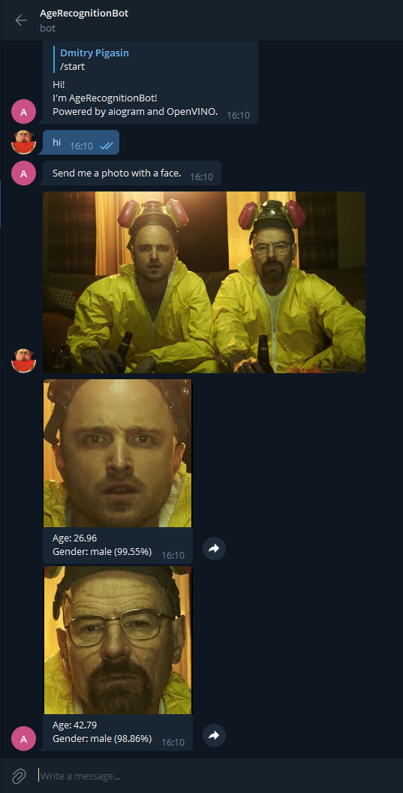

# age_recognition_bot
Telegram bot for age and gender recognition powered by aiogram and OpenVINO™.  
Message processing and image inference is completely asynchronous.  

> At the moment, the bot does not have a permanent hosting, but I run it from time to time.  
> You can send a message [here](https://t.me/age_recognition_bot). It will be processed as soon as the bot appears on the network.  

## Example


## How to run
1. Set the environment variable `AGE_RECOGNITION_BOT_TOKEN` containing a telegram bot token.

2. Download the necessary models from [Open Model Zoo](https://github.com/openvinotoolkit/open_model_zoo) repository and place them in the `models` folder.

    * [age-gender-recognition-retail-0013](https://github.com/openvinotoolkit/open_model_zoo/tree/master/models/intel/age-gender-recognition-retail-0013)
    
    * [face-detection-retail-0005](https://github.com/openvinotoolkit/open_model_zoo/tree/master/models/intel/face-detection-retail-0005)

3. Run the program.
```
python main.py
```

## TODO
* Add logging.
* Use webhooks instead of polling.
* Add an argument parser to set some parameters.
